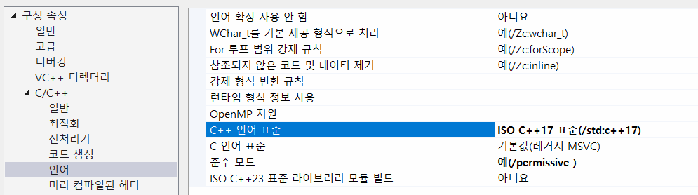

# 알고리즘 고급

## 코딩 테스트

- IT기업 취업 시 면접 전형 중 포함된 면접자 프로그래밍 스킬 파악을 위한 테스트를 뜻함
- CBT(Computer Based Test) 방식으로 진행
- 주관식. 소스코드를 작성해서 제출
- 대기업, 일부 코스닥 상장 기업, 알고리즘이 아주 중요한 IT기업 등에서 진행
- 네(이버)/카(카오)/라(인)/쿠(팡)/배(달의 민족) 기업들이 주요 코딩 테스트 전형 업체
- 네/카/삼(성)/토(스)/배

## 코딩 테스트 환경 설정

코딩 테스트 합격자되기 C++ 진행

### VC++ 17 설정

[링크](https://github.com/dremdeveloper/codingtest_cpp/blob/main/compile_guide.md)

* 프로젝트 속성(Alt+Enter) > 구성 속성 > C/C++ > 언어 > `C++ 언어 표준` > ISO C++17 표준(/std:c++17) 선택

- 필요시마다 해당 C++ 버전으로 변경

### 코딩 테스트 학습 순서 및 중요도

1. [X]  알고리즘 효율 분석(Big O)
2. [ ]  코딩 테스트 필수 문법
3. [ ]  배열
4. [ ]  스택
5. [ ]  큐
6. [X]  해시
7. [ ]  트리
8. [ ]  집합
9. [X]  그래프
10. [X]  백트래킹
11. [ ]  정렬
12. [ ]  시뮬레이션
13. [ ]  동적 계획법(난이도 상)
14. [ ]  그리디

### 코딩 테스트 준비

- 다른 사람의 풀이를 보고 사고 넗혀라
- 테스트 케이스를 잘 이해해야 함
- 문제푸는 과정을 기록할 것
- 실제 시험보듯이 공부할 것
- 짧은 시간 공부해는 통과 못 함

### 문제 분석 방법

1. 문제를 쪼개서 분석할 것
2. 제약(제한)사항 파악하고 테스트케이스 추가할 것
3. 입력 크기 분석(시간복잡도 연관)
4. 핵심 키워드 파악
   1. **최적의 해** - 너비 우선 탐색
   2. **정렬된 상태의 데이터** - 이진 탐색, 파라메트릭 탐색
   3. **최단 경로** - 다익스트라, 벨만-포드, 플로이드-워셜 알고리즘

| 알고리즘 | 키워드                          | 상세                                                                                                                     |
| -------- | ------------------------------- | ------------------------------------------------------------------------------------------------------------------------ |
| 스택     | 쌍이 맞는지 최근 | - 저장을 한뒤 반대로 처리가 필요 - 데이터 조합이 균형적이어야 할 때 - 알고리즘이 재귀적인 특성 - 최근상태 추적 |
| 큐       | 순서대로 ~대로 동작하는 경우 스캐줄링 최소 시간 | - 특정 조건에 따라 시뮬레이션할 때 - 시작 지점부터 목표 지점까지 최단 거리 |
| 깊이 우선 탐색 | 모든 경로 | - 메모리 사용량이 제한적인 탐색 -백트래킹 문제 |
| 너비 우선 탐색 | 최적 레벨 순회 최소 단계 네트워크 전파 | - 시작 지점부터 최단 경로나 최소 횟수를 찾아야 함 |
| 백트래킹 | 조합 순열 부분 집합 | - 조합 및 순열 문제 특정 조건 만족하는 부분 집합 |
| 최단 경로 | 최단 경로 최소 시간 최소 비용 트래픽 음의 순환 단일 출발점 경로 | - 다익스트라, 벨만-포트 |

### 코딩 테스트 저자의 글

- 기본 지식만으로 통과하기 어렵다
-
